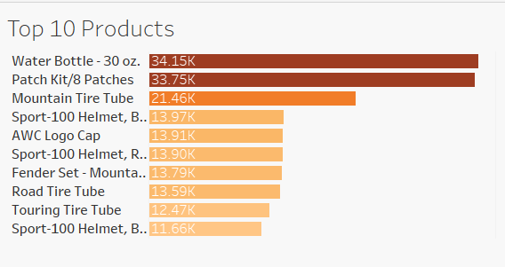

# 🚴 Bike Sales Analysis (Tableau Dashboard)

This project provides a comprehensive **sales performance analysis** for a global bike retailer using **Tableau**.  
It highlights **revenue trends, product performance, customer demographics, and geographic distribution** to support strategic decision-making.

---

## 📌 Business Objective

> Provide actionable insights into **product sales, customer segments, and profitability** to optimize marketing and inventory decisions.

The dashboard answers key questions:

- Which **products** generate the highest sales & profit?
- How does revenue trend over time?
- Which **age groups and genders** contribute most to sales?
- What are the **top-selling subcategories**?
- What is the **geographical distribution** of sales?

---

## 🧩 Dataset Overview

The dataset includes transactional sales and customer demographic details.

### **Key Dimensions**
- Product  
- Product Category  
- Sub Category  
- Customer Gender  
- Age Group  
- Country & State  
- Date (Year, Month, Day)

### **Measures**
- Revenue  
- Profit  
- Unit Price  
- Unit Cost  
- YoY % Change  
- Customer Age  
- Last Year Profit  
- Sales (Count)  
- Order Quantity  

### **Generated in Tableau**
- Latitude / Longitude (for map view)  
- Measure Values & Measure Names  
- Year Filter Parameter  

---

## 🛠️ Tech Stack

- **Tableau Desktop**  
  - Interactive dashboards  
  - Calculated fields & aggregations  
  - Parameter-based filtering  
  - Bubble charts, maps, bar charts, time-series line charts  

- **GitHub** (for versioning & documentation)

---

## 📊 Tableau Dashboard

- This Tableau dashboard analyzes global bike sales performance across products, customer segments, and geographies.
- It helps identify top-selling products, high-value age groups, gender-wise performance, and revenue trends.


## 📊 Dashboard Highlights

### 🔹 **1. Revenue & Profit Overview**
- Total **Revenue**
- Total **Profit**
- **YoY % Change** indicator  
- Monthly **Revenue Trend Line** showing business growth


---

### 🔹 **2. Top 10 Products Sold**
Ranking of products by **quantity sold**, with a color gradient to represent performance.



---

### 🔹 **3. Sales by Product Category (Gender Split)**
- Bar chart comparing **Male vs Female** purchasing behavior  
- Helps identify customer segment preferences

---

### 🔹 **4. Age Group Bubble Chart**
Visualizes the contribution of different **age groups × product subcategories**.


---

### 🔹 **5. Sales by Country**
A world map showing geographic distribution of sales.

---

## 📁 Project Structure
```
Bike-Sales/
│
├── screenshots/ → Images for README
├── excel/ → Cleaned dataset
├── Tableau/ → Dashboard TWBX
└── README.md
